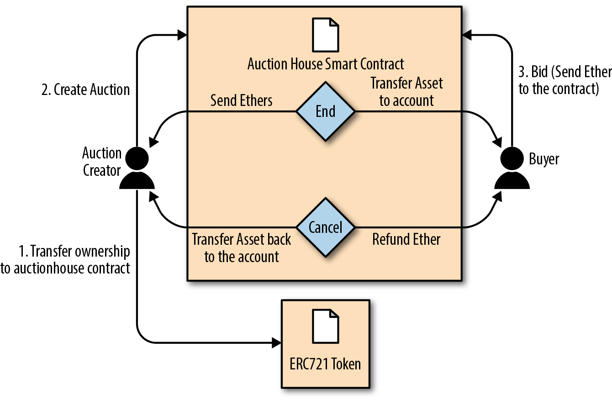

# 🏷️ 이더리움 기반 경매 DApp (Auction DApp)

이 프로젝트는 이더리움 스마트 컨트랙트를 기반으로 한 탈중앙화 경매 시스템(DApp)을 구현합니다.

---

## 📦 프로젝트 개요

- 이더리움 스마트컨트랙트를 활용한 경매 로직 구현
- NFT(ERC721)의 소유권 이전과 입찰 기능 포함
- React 프론트엔드 + Web3.js 기반 UI

---

## ✅ 사용 기술 스택

| 항목 | 기술 |
|------|------|
| 스마트컨트랙트 | Solidity (DeedRepository, AuctionRepository) |
| 프론트엔드 | React + Web3.js |
| 테스트넷 | Holesky |

---

## 🧭 경매 DApp 구성도 및 흐름

1. **NFT 등록**  
   DeedRepository 컨트랙트를 통해 고유한 ERC721 토큰을 발행하고 메타데이터를 연결합니다.

2. **소유권 이전**  
   발행된 NFT의 소유권을 AuctionRepository 컨트랙트로 이전합니다.

3. **경매 생성**  
   이름, 시작가, 마감 시간 등을 설정하여 경매를 생성합니다.

4. **입찰**  
   누구나 입찰 가능 (단, 경매 소유자는 불가능). 기존 입찰자는 환불 처리됨.

5. **경매 종료 후 처리**  
   - 낙찰자 존재 시: NFT를 낙찰자에게 이전, 입찰 금액은 판매자에게 전송  
   - 낙찰자 없음 또는 경매 취소 시: NFT 반환, 입찰 금액 환불

---

## 📌 입찰 조건

- 경매가 아직 종료되지 않았어야 함
- 입찰자는 경매 소유자가 아니어야 함
- 입찰 금액은 현재 최고가보다 높아야 함 (또는 시작가 이상)

---

## 🧾 경매 취소 및 환불

- 경매 취소 시:
  - NFT는 원래 주인에게 반환
  - 입찰자가 있으면 입찰 금액 환불

- 경매 완료 시:
  - 최고 입찰자에게 NFT 전송
  - 입찰 금액은 경매 생성자에게 전송

---

## ✅ 요약

> 이 경매 DApp은 스마트컨트랙트, 탈중앙 저장소, ENS를 연동하여  
> **관리자 없는**, **서버 없는**, **검열 불가능한** 진정한 Web3 애플리케이션을 구현합니다.